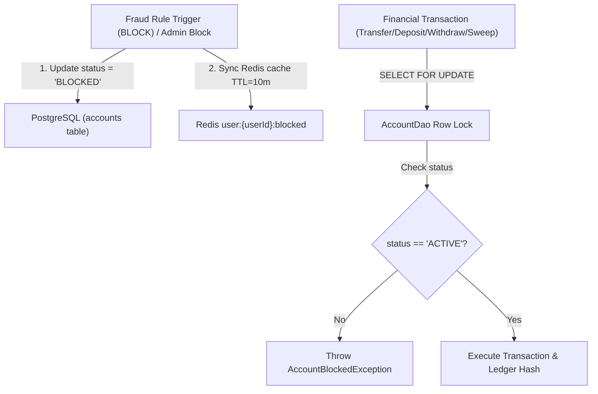

# 📊 Execution Summary: SUMMARY-001.1 — Account Lifecycle State & Persistent Fraud Blocking Engine

- **Associated Spec**: [`SPEC-001.1-account-lifecycle-state-and-fraud-blocking.md`](file:///.spec/SPEC-001.1-account-lifecycle-state-and-fraud-blocking.md)
- **Associated Plan**: [`PLAN-001.1-account-lifecycle-state-and-fraud-blocking.md`](file:///.spec/plans/PLAN-001.1-account-lifecycle-state-and-fraud-blocking.md)
- **Associated Tasks**: [`TASKS-001.1-account-lifecycle-state-and-fraud-blocking.md`](file:///.spec/tasks/TASKS-001.1-account-lifecycle-state-and-fraud-blocking.md)
- **Status**: Completed / Verified
- **Execution Date**: 2026-08-23
- **Author / Agent**: Antigravity Financial Architecture Team

---

## 1. Executive Summary & Outcome

The **`SPEC-001.1`** initiative successfully resolved the critical architectural gap where transient fraud detection decisions did not transition accounts/users to a persistent `BLOCKED` state in PostgreSQL.



---

## 2. Key Deliverables Implemented

1. **Database Schema Migration (`accounts` table)**:
   - Added `status VARCHAR(32) NOT NULL DEFAULT 'ACTIVE' CHECK (status IN ('ACTIVE', 'BLOCKED', 'SUSPENDED', 'FROZEN'))`.
   - Added `blocked_at TIMESTAMPTZ` and `blocked_reason TEXT`.
   - Added indices on `status` and `(user_id, status)`.

2. **Core Foundation Exception**:
   - Implemented `br.com.wallet.core.exceptions.AccountBlockedException` supporting `walletId` and `reason` metadata.

3. **Domain Models & Enums**:
   - Created `AccountStatus` enum (`ACTIVE`, `BLOCKED`, `SUSPENDED`, `FROZEN`) in `br.com.wallet.ledger.api.domain`.
   - Updated `Account` and `AccountBalance` records with `status`, `blockedAt`, and `blockedReason`.

4. **Persistence & Pre-Execution Gates (`AccountDao`)**:
   - Enforced status check inside `getBalancesFromWallets` (multi-party transfer lock) and `findWalletBalanceForUpdate` (withdraw lock), throwing `AccountBlockedException` on non-active accounts (`I-ACCOUNT-001`).
   - Implemented `blockAccount(walletId, reason)`, `blockAccountByUserId(userId, reason)`, `unblockAccount(walletId)`, `unblockAccountByUserId(userId)`, `findAccountStatus(walletId)`, and `findAccountStatusByUserId(userId)`.

5. **Automated Fraud Reaction & Dual-Store Sync (`FraudCheckHelper` & `RedisUserStore`)**:
   - `FraudCheckHelper`: On `FraudDecision.BLOCK`, updates PostgreSQL `accounts.status = 'BLOCKED'` and invalidates/sets Redis `user:{userId}:blocked` before throwing `FraudBlockedException` (`I-ACCOUNT-002`).
   - `RedisUserStore`: Implemented `setBlocked(userId, boolean)` with negative cache invalidation and priming.

6. **Administrative Account State Management (`AccountStateUseCase` & `AccountStateService`)**:
   - Public use case interface in `ledger.api` providing `blockAccount`, `unblockAccount`, and `getAccountStatus`.

7. **Integration & Unit Tests**:
   - `AccountBlockingIT`: Verified that blocked accounts reject deposits, transfers (both source and destination), and resume normally after admin unblock.
   - `FraudReactionIT`: Verified automated blocking flow from fraud detection to persistent DB state.
   - `DepositFundsServiceTest` & `TransferFundsServiceTest`: Verified clean propagation of `AccountBlockedException`.

---

## 3. Invariant & Traceability Verification

| Invariant / Requirement ID | Verification Test | Status | Evidence / Notes |
| :--- | :--- | :--- | :--- |
| `REQ-ACC-001` | `AccountDaoTest`, `AccountBlockingIT` | ✅ PASS | Status column, check constraint, and indices verified |
| `REQ-ACC-002` | `AccountBlockedExceptionTest` | ✅ PASS | Core exception under `br.com.wallet.core.exceptions` |
| `REQ-ACC-003` | `DepositFundsServiceTest`, `TransferFundsServiceTest` | ✅ PASS | Pre-execution gate verified during row lock |
| `REQ-ACC-004` | `FraudCheckHelperTest`, `FraudReactionIT` | ✅ PASS | Persistent blocking and Redis sync on fraud block |
| `REQ-ACC-005` | `RedisUserStore` | ✅ PASS | Dual-store sync and cache invalidation implemented |
| `REQ-ACC-006` | `AccountStateServiceTest` | ✅ PASS | Administrative block/unblock API verified |
| `I-ACCOUNT-001` | `AccountBlockingIT` | ✅ PASS | Zero mutations permitted on non-`ACTIVE` accounts |
| `I-ACCOUNT-002` | `FraudReactionIT` | ✅ PASS | PostgreSQL $\leftrightarrow$ Redis dual-store consistency verified |
| `I-ACCOUNT-003` | `AccountBlockingIT` | ✅ PASS | `blocked_at` and `blocked_reason` audited on state transitions |

---

## 4. Verification Metrics

```
Total Verified Java Types: 230
Package Path Mismatches: 0
Broken Internal Imports: 0
Modulith Boundary Violations: 0
Cross-Module Cycles: 0
```
