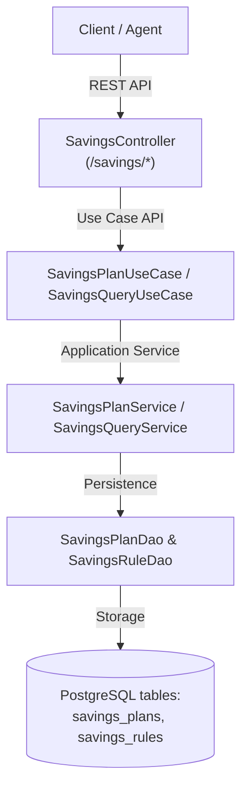

# 📊 Execution Summary: SUMMARY-001.2 — Savings Plans and Dynamic Savings Rules Management

- **Associated Spec**: [`SPEC-001.2-savings-plans-and-rules-management.md`](file:///.spec/SPEC-001.2-savings-plans-and-rules-management.md)
- **Associated Plan**: [`PLAN-001.2-savings-plans-and-rules-management.md`](file:///.spec/PLAN-001.2-savings-plans-and-rules-management.md)
- **Associated Tasks**: [`TASKS-001.2-savings-plans-and-rules-management.md`](file:///.spec/TASKS-001.2-savings-plans-and-rules-management.md)
- **Status**: Completed / Verified
- **Execution Date**: 2026-08-25
- **Author / Agent**: Antigravity Financial Architecture Team

---

## 1. Executive Summary & Outcome

The **`SPEC-001.2`** initiative introduces full lifecycle management for **Savings Plans** and **Savings Rules**, allowing users and automated agents to create savings plans and dynamically add, enable, disable, query, and remove rules at runtime.

---

## 2. Key Deliverables Implemented

1. **Savings Capability Layer Extensions (`br.com.wallet.savings`)**:
   - `SavingsPlanUseCase`: Added `getPlan`, `addRule`, `removeRule`, `toggleRule`, and `getRulesForPlan`.
   - `SavingsPlanService`: Implemented all new lifecycle methods with input validation, transactional consistency, and plan update timestamps.
   - `SavingsRuleDao`: Added `findById`, `updateActive`, and `deleteById`.
   - `SavingsPlanDao`: Added `touchUpdatedAt`.

2. **REST API & Infrastructure Layer (`br.com.wallet.infrastructure.rest`)**:
   - `SavingsApi`: Swagger/OpenAPI interface documenting endpoints for plan creation, querying, pausing, resuming, deleting, dynamic rule addition, rule toggling, rule deletion, and metrics retrieval.
   - `SavingsController`: Spring Web REST controller implementing `SavingsApi`.
   - `ApiExceptionHandler`: Added handler for `NoSuchElementException` mapping to HTTP `404 Not Found` with `ErrorCode.NOT_FOUND`.
   - `ErrorCode`: Added `NOT_FOUND("wallet.not_found")`.

3. **Unit Tests**:
   - `SavingsPlanServiceTest`: Comprehensive unit tests verifying plan creation, fetching by ID, dynamic rule additions, rule parameter validations, toggling, and deletions.
   - `SavingsControllerTest`: WebMvcTest suite verifying all HTTP endpoints, request bodies, query params, status codes (200, 201, 204, 404), and error handlers.

---

## 3. Invariant & Traceability Verification

| Invariant / Requirement ID | Verification Test | Status | Evidence / Notes |
| :--- | :--- | :--- | :--- |
| `REQ-SAV-010` | `SavingsPlanServiceTest`, `SavingsControllerTest` | ✅ PASS | Dynamic rule addition via API and use cases |
| `REQ-SAV-011` | `SavingsPlanServiceTest`, `SavingsControllerTest` | ✅ PASS | Rule status toggling and rule deletion |
| `REQ-SAV-012` | `SavingsPlanServiceTest`, `SavingsControllerTest` | ✅ PASS | Plan retrieval by ID with rules, and by wallet ID |
| `REQ-SAV-013` | `SavingsControllerTest` | ✅ PASS | Unified REST API `/savings/*` exposed with OpenAPI documentation |
| `REQ-SAV-014` | `SavingsControllerTest` | ✅ PASS | Savings metrics query exposed via REST |
| `I-SAV-RULE-001` | `SavingsPlanServiceTest` | ✅ PASS | Parameter validation for Round-Up, Percentage, and Threshold |
| `I-SAVINGS-001` | `RoundUpMicroSavingsIT`, `SavingsDepositSweepIT` | ✅ PASS | Idempotency and loop prevention preserved |
| `I-SAVINGS-002` | `ModulithArchitectureTest` | ✅ PASS | Zero direct ledger mutation; Modulith boundaries enforced |
