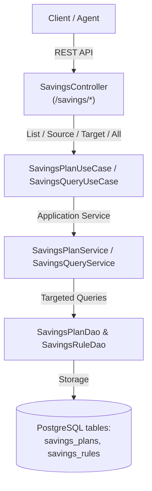

# 📊 Execution Summary: SUMMARY-001.2 — Savings Plans and Dynamic Savings Rules Management

- **Associated Spec**: [`SPEC-001.2-savings-plans-and-rules-management.md`](file:///.spec/SPEC-001.2-savings-plans-and-rules-management.md)
- **Associated Plan**: [`PLAN-001.2-savings-plans-and-rules-management.md`](file:///.spec/PLAN-001.2-savings-plans-and-rules-management.md)
- **Associated Tasks**: [`TASKS-001.2-savings-plans-and-rules-management.md`](file:///.spec/TASKS-001.2-savings-plans-and-rules-management.md)
- **Status**: Completed / Verified
- **Execution Date**: 2026-08-26
- **Author / Agent**: Antigravity Financial Architecture Team

---

## 1. Executive Summary & Outcome

The **`SPEC-001.2`** initiative introduces full lifecycle management for **Savings Plans** and **Savings Rules**, allowing users and automated agents to create savings plans, list all plans with pagination, query plans by source or target wallet, and dynamically add, enable, disable, query, and remove rules at runtime. It specifically addresses source vs. target wallet query isolation across all layers (DAO, Use Case, REST API) and delivers dedicated PostgreSQL and REST integration test suites.

---

## 2. Key Deliverables Implemented

1. **Savings Capability Layer Extensions (`br.com.wallet.savings`)**:
   - `SavingsPlanUseCase`: Added `listPlans`, `getPlansBySourceWallet`, `getPlansByTargetWallet`, `getPlansForWallet`, `getPlan`, `addRule`, `removeRule`, `toggleRule`, and `getRulesForPlan`.
   - `SavingsPlanService`: Implemented all methods with pagination (`listPlans(limit, offset)`), source/target isolation, input validation, and transactional consistency.
   - `SavingsRuleDao`: Added `findById`, `updateActive`, and `deleteById`.
   - `SavingsPlanDao`: Added `findAll(limit, offset)`, `findBySourceWalletId`, `findByTargetWalletId`, `findByWalletId`, `findActiveBySourceWalletId`, `findActiveByTargetWalletId`, and `touchUpdatedAt`.

2. **REST API & Infrastructure Layer (`br.com.wallet.infrastructure.rest`)**:
   - `SavingsApi` & `SavingsController`:
     - `GET /savings/plans` — Lists all savings plans with pagination (`?limit=100&offset=0`).
     - `GET /savings/plans/source/{sourceWalletId}` — Specifically queries plans where the wallet is the **source wallet**.
     - `GET /savings/plans/target/{targetWalletId}` — Specifically queries plans where the wallet is the **target wallet**.
     - `GET /savings/plans/wallet/{walletId}` — Queries all plans where the wallet is either source or target.
     - `POST /savings/plans` — Create plan.
     - `GET /savings/plans/{planId}` — Get plan by ID.
     - `POST /savings/plans/{planId}/pause` / `/resume` — Pause/resume plan.
     - `DELETE /savings/plans/{planId}` — Delete plan.
     - `POST /savings/plans/{planId}/rules` — Add rule to existing plan.
     - `GET /savings/plans/{planId}/rules` — Get rules for plan.
     - `PATCH /savings/rules/{ruleId}/status` — Enable/disable rule.
     - `DELETE /savings/rules/{ruleId}` — Delete rule.
     - `GET /savings/metrics/{walletId}` — Savings metrics.
   - `ApiExceptionHandler`: Added handler for `NoSuchElementException` mapping to HTTP `404 Not Found` with `ErrorCode.NOT_FOUND`.

3. **Comprehensive Test Suites**:
   - `SavingsPlanPersistenceIT`: PostgreSQL container integration test verifying that `findAll(limit, offset)`, `findBySourceWalletId`, `findByTargetWalletId`, and `findByWalletId` return strictly the correct subset of plans.
   - `SavingsRestIT`: End-to-end REST integration test verifying all HTTP endpoints (including paginated plan listing) with real database state and source/target query segregation.
   - `SavingsPlanServiceTest`: Unit tests for paginated listing, source/target query routing, and rule management.
   - `SavingsControllerTest`: WebMvcTest suite verifying all HTTP endpoints including `GET /savings/plans`.

---

## 3. Invariant & Traceability Verification

| Invariant / Requirement ID | Verification Test | Status | Evidence / Notes |
| :--- | :--- | :--- | :--- |
| `REQ-SAV-010` | `SavingsPlanServiceTest`, `SavingsControllerTest`, `SavingsRestIT` | ✅ PASS | Dynamic rule addition via API and use cases |
| `REQ-SAV-011` | `SavingsPlanServiceTest`, `SavingsControllerTest`, `SavingsRestIT` | ✅ PASS | Rule status toggling and rule deletion |
| `REQ-SAV-012` | `SavingsPlanPersistenceIT`, `SavingsRestIT` | ✅ PASS | Paginated listing and source vs target wallet isolation verified in PostgreSQL |
| `REQ-SAV-013` | `SavingsControllerTest`, `SavingsRestIT` | ✅ PASS | Specific REST endpoints `/savings/plans`, `/savings/plans/source/*`, and `/savings/plans/target/*` |
| `REQ-SAV-014` | `SavingsControllerTest`, `SavingsRestIT` | ✅ PASS | Savings metrics query exposed via REST |
| `I-SAV-RULE-001` | `SavingsPlanServiceTest` | ✅ PASS | Parameter validation for Round-Up, Percentage, and Threshold |
| `I-SAVINGS-001` | `RoundUpMicroSavingsIT`, `SavingsDepositSweepIT` | ✅ PASS | Idempotency and loop prevention preserved |
| `I-SAVINGS-002` | `ModulithArchitectureTest` | ✅ PASS | Zero direct ledger mutation; Modulith boundaries enforced |

---

## 4. Initial Seed Data Deliverables

To guarantee out-of-the-box functionality in local development, testing, and Docker environments, seed data has been added to `src/main/resources/data.sql`, `src/main/resources/schema.sql`, and `docker/init/schema.sql`:

1. **3 Seeded Savings Plans**:
   - `d1111111-1111-1111-1111-111111111111`: Main Wallet $\rightarrow$ Savings Vault (ACTIVE) with 3 rules (Round-Up, Percentage, Threshold).
   - `d2222222-2222-2222-2222-222222222222`: Secondary Wallet $\rightarrow$ Savings Vault (ACTIVE) with 2 rules (Round-Up, Percentage).
   - `d3333333-3333-3333-3333-333333333333`: Main Wallet $\rightarrow$ Secondary Wallet (PAUSED) with 1 rule (Threshold).
2. **6 Seeded Savings Rules**: Fully populated and mapped to the respective plans.
