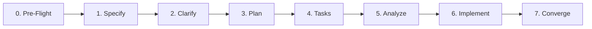

# 🤖 Antigravity Agent Guide — Wallet Service

Welcome to the **Wallet Service** codebase. This repository uses **Spec-Driven Design (SDD)** and **Antigravity Customizations** to ensure reliable, high-performance financial engineering.

---

## 🧠 Context Hierarchy & Progressive Disclosure

To maximize reasoning efficiency and prevent context window degradation ("lost in the middle" problem), follow the **5-layer cache hierarchy**:

| Layer | Type | Location | Purpose |
| :--- | :--- | :--- | :--- |
| **L0: Constitution** | Immutable Constraints | [`.agents/rules/constitution.md`](file:///.agents/rules/constitution.md) | Absolute financial & architectural invariants (never violate). |
| **L1: Rules** | Persistent Context | [`.agents/rules/`](file:///.agents/rules/) | Architectural standards, coding conventions, testing guidelines. |
| **L2: Skills** | On-Demand Knowledge | [`.agents/skills/`](file:///.agents/skills/) | Procedural domain workflows (loaded progressively when needed). |
| **L3: Specifications**| Working Set | [`.spec/`](file:///.spec/) | Feature requirements, invariant definitions, tasks & plans. |
| **L4: Source Code** | Implementation Evidence | [`src/`](file:///src/), [`core/`](file:///core/), [`fraud/`](file:///fraud/) | Targeted files modified strictly within specification bounds. |

> **Context Hygiene Rule**: Never load entire classes or massive command outputs into memory. When executing a task, isolate focus using the **Active Task Card Protocol**.

---

## 🔄 Spec-Driven Development (SDD) Pipeline — V2 Deterministic Edition

Every significant feature, refactor, or architectural change follows the **8-Stage Spec Kit Pipeline**:

1. **Pre-Flight**: Audit `.histories/` and preceding `SUMMARY-*.md` for past ADRs and established invariants.
2. **Specify** (`.spec/SPEC-XXX.md`): Define user intent, atomic slice ($\le 250$ lines), **MoSCoW requirements** (`[MUST]`, `[SHOULD]`, `[COULD]`, `[WON'T]`), **Cross-Feature Impact Matrix**, and **mathematical invariants**.
3. **Clarify**: Resolve ambiguities, trade-offs, and edge cases with the human engineer.
4. **Plan** (`.spec/plans/PLAN-XXX.md`): Modulith boundaries, interface contracts, ADRs, and concurrency strategy.
5. **Tasks** (`.spec/tasks/TASKS-XXX.md`): Prioritized atomic TDD task breakdown with Active Task Cards (`[MUST]` tasks executed first).

6. **Analyze**: Pre-implementation consistency gate verifying 100% traceability between Spec, Plan, and Tasks.
7. **Implement**: TDD execution (Red $\rightarrow$ Green $\rightarrow$ Refactor) with Zero Vibe Coding (exact `BigDecimal` scale 2 arithmetic, mandatory test triads).
8. **Converge**: Bi-directional equivalence verification (zero spec-code drift), architecture test pass, coverage verification, and Practical Verification Guide with seed data (`I-SDD-002`, `I-SDD-003`).

---

## 👥 Strategic Subagent Team Topology

To protect the orchestrator's context window from pollution, delegate work across specialized subagent roles:

- **System Researcher** (Read-Only): Performs pre-flight audits, inspects code, builds cross-feature impact matrices.
- **Spec Analyst** (Read-Only): Analyzes Spec ↔ Plan ↔ Tasks consistency at the Stage 5 gate.
- **TDD Implementer** (Write / Branch): Executes Red $\to$ Green $\to$ Refactor cycles on an isolated task card in a dedicated workspace.
- **Convergence Auditor** (Command): Runs `./gradlew test` and Modulith architecture checks, asserting zero drift before summary authoring.

---

## 🗂️ Active Customization Index

### Rules ([`.agents/rules/`](file:///.agents/rules/))
- [`constitution.md`](file:///.agents/rules/constitution.md) — Absolute financial invariants & core non-negotiable rules.
- [`project-context.md`](file:///.agents/rules/project-context.md) — Architecture overview, tech stack, and module boundaries.
- [`capability-boundaries.md`](file:///.agents/rules/capability-boundaries.md) — Architectural mantra, Spring Modulith boundaries, and capability rules.
- [`coding-standards.md`](file:///.agents/rules/coding-standards.md) — Modern Java 27 patterns, immutability, zero boilerplate.
- [`testing-standards.md`](file:///.agents/rules/testing-standards.md) — TDD methodology, Zero Vibe Coding, Testcontainers, and test triads.

### Skills ([`.agents/skills/`](file:///.agents/skills/))
- [`spec-driven-development`](file:///.agents/skills/spec-driven-development/SKILL.md) — 8-stage Spec Kit orchestration, templates, MoSCoW, and convergence verification.
- [`design-spec-extraction`](file:///.agents/skills/design-spec-extraction/SKILL.md) — Token-compliant multi-pass extraction, product vs technical intent separation, and behavior over implementation focus.
- [`capability-driven-development`](file:///.agents/skills/capability-driven-development/SKILL.md) — Spring Modulith capability building, action lifecycle, and boundaries.
- [`ledger-engineering`](file:///.agents/skills/ledger-engineering/SKILL.md) — Hash-chained tamper detection, atomic transfers, ledger reconstruction.
- [`antifraud-engineering`](file:///.agents/skills/antifraud-engineering/SKILL.md) — Multi-tier fraud detection, sliding windows, Lua scripts, Caffeine/DragonflyDB caching.
- [`outbox-messaging`](file:///.agents/skills/outbox-messaging/SKILL.md) — Transactional outbox pattern, NATS JetStream, deduplication, retry exponential backoff.
- [`observability-tracing`](file:///.agents/skills/observability-tracing/SKILL.md) — OpenTelemetry spans, baggage propagation (`operationId`), OTLP exports.

### Workflows ([`.agents/workflows/`](file:///.agents/workflows/))
- [`sdd-feature.md`](file:///.agents/workflows/sdd-feature.md) — End-to-end workflow for implementing new features.
- [`sdd-bugfix.md`](file:///.agents/workflows/sdd-bugfix.md) — Reproduction and fix workflow with regression tests.
- [`sdd-refactor.md`](file:///.agents/workflows/sdd-refactor.md) — Safe refactoring with behavioral equivalence guarantees.
