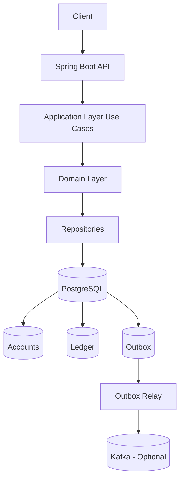
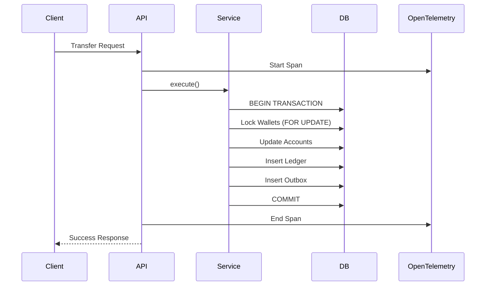
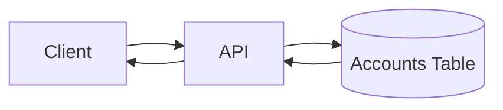
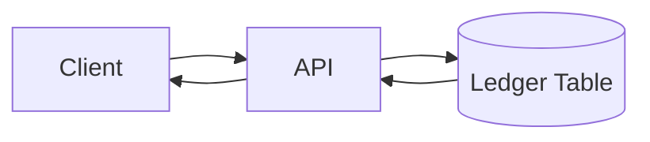

# 💳 Wallet Service — Transactional Ledger System

## 📌 Overview

This project implements a **wallet transaction system** with strong consistency guarantees, auditability, and scalability in mind.

The system supports:

* Create Wallet
* Retrieve Current Balance
* Retrieve Historical Balance
* Deposit Funds
* Withdraw Funds
* Transfer Funds

The architecture follows a **clean and pragmatic approach**, combining:

* **ACID transactions (PostgreSQL)**
* **Ledger-based accounting model**
* **Transactional Outbox pattern (event-ready)** 
* **End-to-end traceability using OpenTelemetry**
---

## 🧠 Architectural Principles

* **Ledger is the source of truth**
* **Accounts table is a fast, consistent projection model**
* **All financial operations are atomic**
* **Immutability for auditability**
* **Event-driven ready (without runtime complexity)**
* **Cross-cutting concerns via AOP (lower boilerplate and observability standards)**

## 🧩 Design Principles

### Domain-Driven Design (DDD)

The system is structured around core domain concepts such as **Wallet** and **LedgerEntry**, ensuring that business rules (e.g. balance validation, transfers) are enforced within the domain layer.

The goal is to:
- Keep business logic explicit and centralized
- Avoid anemic models
- Make financial rules easy to reason about and evolve

---

### Test-Driven Development (TDD)

The development process follows a **test-first approach**, especially for critical financial flows such as transfers.

This ensures:
- correctness of business rules
- safe refactoring
- reproducible edge-case validation (e.g. insufficient balance, concurrent transfers)

---

### Clean Code

The codebase emphasizes:
- clear separation of concerns (application, domain, infrastructure)
- small and focused use cases
- readability over cleverness
- this improves maintainability and onboarding for new developers.
---

## 🔍 Observability & Traceability

The system is designed with **end-to-end traceability** using OpenTelemetry.

Each request (e.g. transfer, deposit) is traced across:

- API layer
- Application (use case execution)
- Database interactions

### What is traced

- Transaction execution time
- Wallet IDs involved in operations
- Ledger entry creation
- Outbox event generation

### Why this matters

In financial systems, observability is critical for:

- debugging inconsistencies
- auditing operations
- understanding system behavior under load

### Future Extensions

- Distributed tracing with Kafka consumers
- Correlation between API requests and emitted events
- Integration with tools like Jaeger / Grafana Tempo
---


## 🏗️ High-Level Architecture



---

## 🧱 Data Model

### Accounts (Current State - Fast Reads)

* Stores current wallet balance
* Updated synchronously during transactions

### Ledger (Source of Truth)

* Immutable record of all financial operations
* Tamper-proof ledger (hash chaining)
  - hash = SHA256(
    previous_hash +
    wallet_id +
    amount +
    type +
    operation_id +
    sequence
    )
* Used for:

    * audit
    * reconciliation
    * historical balance

### Outbox (Event Buffer)

* Stores events inside the same DB transaction
* Never loose an event
* Support retries!
* Enables reliable event publishing (future Kafka/Messaging cluster integration)

---

## 🔄 Transaction Flow (Write Path)



---

## 📊 Read Flow (Queries)

### Current Balance



* O(1) lookup
* High performance

---

### Historical Balance



Computed using:

```sql
SELECT SUM(amount)
FROM ledger
WHERE wallet_id = :walletId
AND created_at <= :timestamp;
```

---

## 💰 Core Use Cases

### 1. Create Wallet

* Generates a unique wallet ID (UUID)
* Initializes balance to zero

---

### 2. Retrieve Balance

* Reads directly from `accounts`
* Strongly consistent

---

### 3. Retrieve Historical Balance

* Aggregates ledger entries up to a given timestamp

---

### 4. Deposit Funds

* Validates amount > 0
* Inserts CREDIT entry in ledger
* Updates account balance

---

### 5. Withdraw Funds

* Validates sufficient balance
* Inserts DEBIT entry in ledger
* Updates account balance

---

### 6. Transfer Funds

* Atomic operation involving two wallets
* Ensures:

    * no partial updates
    * no race conditions

---

## 🔐 Consistency Guarantees

* All operations are wrapped in **single database transactions**
* Uses **row-level locking (`SELECT FOR UPDATE`)**
* Prevents:

    * double spending
    * race conditions
    * inconsistent balances

---

## 🧾 Idempotency

Each operation includes an `operation_id`:

* Prevents duplicate processing
* Ensures safe retries

---

## 🧩 Why Not Event Sourcing?

Event sourcing was considered but not chosen due to:

* Higher operational complexity
* Rebuild overhead
* Steeper learning curve

The **ledger-based model** provides:

* sufficient auditability
* simpler implementation
* strong consistency

---

## 🔌 Event-Driven Readiness

The system uses the **Transactional Outbox pattern**:

* Events are stored in the same DB transaction
* Guarantees no data/event mismatch

Kafka integration can be added later without changing business logic.

---

## 🚀 Future Improvements

* Ledger Historic Balance Snapshot 
  - instead of O(n), we reduce to O(k), where k is last snapshot size (we can take periodic snapshots)
* Ledger Incremental Validation, validate only new entries since last validation (O(1) amortized)
* Kafka integration (Outbox → Kafka relay)
* Fraud detection consumers
* Multi-currency support
* Ledger hash chaining (tamper-proof audit)
* Rate limiting / compliance rules
* Build tuning (gradle configuration caching) 

---

## ⚙️ Tech Stack

* Java 26
* Spring Boot 4
* PostgreSQL
* Docker (for local setup)

---

## 🧪 Testing Strategy

* Unit tests for use cases
* Integration tests for transaction flows
* Focus on:

    * transfers
    * concurrency
    * balance correctness

---

## 📎 Key Design Trade-offs

| Decision          | Reason                             |
| ----------------- | ---------------------------------- |
| Ledger + Accounts | Balance performance + auditability |
| No Kafka runtime  | Simplicity for evaluation          |
| Outbox included   | Demonstrates production readiness  |
| No Event Sourcing | Avoid unnecessary complexity       |

---

## 🧭 Summary

This system prioritizes:

* **Correctness over complexity**
* **Clarity over abstraction**
* **Extensibility without overengineering**

It is designed to evolve into a fully event-driven architecture while remaining simple and reliable.
