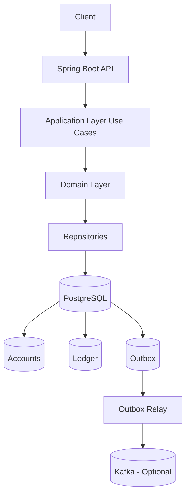
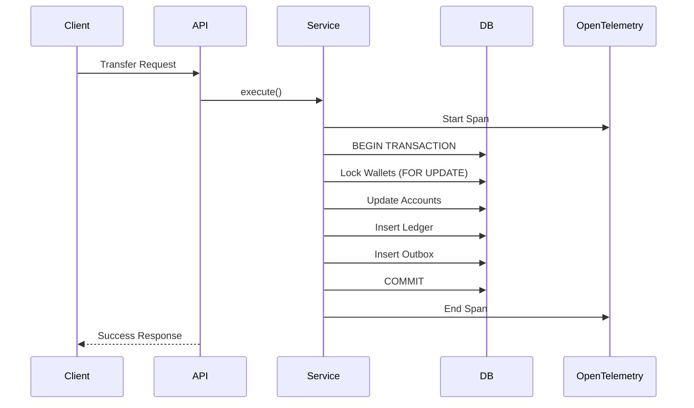
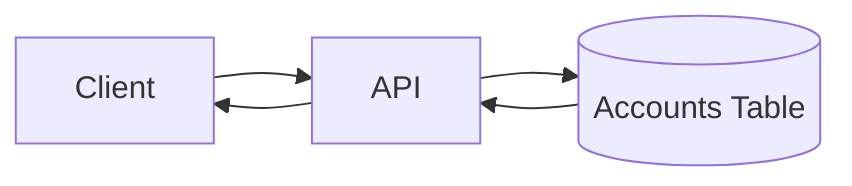
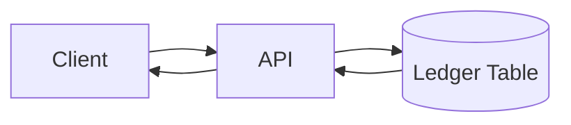

# 💳 Wallet Service — Transactional Ledger System

## 📌 Overview

This project is a **wallet service** built with **Spring Boot 4**, designed to demonstrate:
- Clean architecture principles
- Test-Driven Development (TDD)
- Production-oriented thinking (idempotency, auditability, resilience)

Supported operations:
- Transfer between wallets
- Deposit
- Withdraw
- Balance retrieval (current + historical)
- Ledger inspection (audit/debug)

The development follows a **clean and pragmatic approach**, combining:

* **ACID transactions (PostgreSQL)**
* **Ledger-based accounting model**
* **Transactional Outbox pattern (event-ready)** 
* **End-to-end traceability using OpenTelemetry**
* **Future extensions over outbox pattern**
---

## 🧠 Architectural Principles

The system follows **Clean Architecture principles**:

```
[ REST Controllers ]
        ↓
[ Use Cases / Application ]
        ↓
[ Domain ]
        ↓
[ Infrastructure (DB, Outbox, etc.) ]
```
### Key Design Choices

- **Thin controllers** → only validation + orchestration
- **Use cases own business flow**
- **Domain is framework-agnostic**
- **Explicit boundaries between layers**
* **Ledger is the source of truth**
* **Accounts table is a fast, consistent projection model**
* **All financial operations are atomic**
* **Immutability for auditability**
* **Outbox gives Event-driven ready extension**
* **Cross-cutting concerns via AOP (lower boilerplate and observability standards)**
* **API Contract as Interface**
* **Stripe style idempotent requests**

## 🧩 Design Principles

### Domain-Driven Design (DDD)

The system is structured around core domain concepts such as **Wallet** and **LedgerEntry**, ensuring that business rules (e.g. balance validation, transfers) are enforced within the domain layer.

The goal is to:
- Keep business logic explicit and centralized
- Avoid anemic models
- Make financial rules easy to reason about and evolve

---

### Test-Driven Development (TDD)

The development process follows a **test-first approach**, especially for critical financial flows such as transfers.

This ensures:
- correctness of business rules
- safe refactoring
- reproducible edge-case validation (e.g. insufficient balance, concurrent transfers)

---

### Clean Code

The codebase emphasizes:
- clear separation of concerns (application, domain, infrastructure)
- small and focused use cases
- readability over cleverness
- this improves maintainability and onboarding for new developers.
---


## 🧪 Testing Strategy

This project was developed using **TDD-first approach**.

### Domain & Use Cases
- Fully unit tested
- Covers financial correctness (balances, transfers, edge cases)

### Integration Tests
- Testcontainers bootstrap with PostgreSQL runtime
- Validate persistence, ledger, and outbox behavior
- Ensure correctness of:
  - Hash chain integrity
  - Historical balance
  - Retry mechanisms

### REST Layer
- Tested with `MockMvc`
- Use cases mocked via Mockito (Spring Boot 4)

Focus:
- HTTP contract
- Validation
- Error handling

---

## 🔐 Ledger & Auditability

The system maintains a **hash-chained ledger**, ensuring:

- Tamper detection
- Historical reconstruction
- Auditability

Each entry includes:
- Previous hash
- Deterministic hash input
- Sequence ordering

Validation detects:
- Broken chains
- Hash inconsistencies

---

## 🧠 Engineering Highlights

- Deterministic hashing (BigDecimal normalization issue solved)
- Ledger integrity validation
- Retry-safe event processing
- Isolation of business logic from frameworks
- Realistic financial modeling

## 🔁 Idempotency

Operations support **idempotency via header**:

```
Idempotency-Key: <UUID>
```

Prevents:
- Duplicate transfers
- Double processing

---

## 📦 Outbox Pattern

Implemented for reliability (and for future extensions):

- Events stored in DB
- Processed asynchronously
- Retry on failure
- Status tracking (PENDING, FAILED, PROCESSED)

---

## 🔍 Observability & Traceability

The system is designed with **end-to-end traceability** using OpenTelemetry.

Each request (e.g. transfer, deposit) is traced across:

- Application (use case execution)
- Database interactions
- DEV NOTES: "We started with debug exporter to validate telemetry flow, 
  but in a real production system we would switch to a proper backend like Prometheus or Grafana, 
  and carefully control metric cardinality and export frequency to avoid unnecessary overhead."

### What is traced

- Transaction execution time
- Wallet IDs involved in operations
- Ledger entry creation
- Outbox event generation

### Why this matters

In financial systems, observability is critical for:

- debugging inconsistencies
- auditing operations
- understanding system behavior under load

### Future Extensions

- Distributed tracing with Messaging consumers
- Correlation between API requests and emitted events
- Integration with other tools like Jaeger / Grafana Tempo
---


## 🏗️ High-Level Architecture



---

## 🧱 Data Model

### Accounts (Current State - Fast Reads)

* Stores current wallet balance
* Updated synchronously during transactions

### Ledger (Source of Truth)

* Immutable record of all financial operations
* Tamper-proof ledger (hash chaining)
  - hash = SHA256(
    previous_hash +
    wallet_id +
    amount +
    type +
    operation_id +
    sequence
    )
* Used for:

    * audit
    * reconciliation
    * historical balance

### Outbox (Event Buffer)

* Stores events inside the same DB transaction
* Never loose an event
* Support retries!
* Enables reliable event publishing (future Messaging cluster integration)

---

## 🔄 Transaction Flow (Write Path)



---
## 📊 Actuator

Enabled endpoints:

- `/actuator/health`
- `/actuator/info`
- `/actuator/metrics`

---

## 🧱 C4 Model

### Level 1 — System Context

```
[ Client ]
    ↓
[ Wallet Service ]
    ↓
[ Database ]
```

---

### Level 2 — Container Diagram

```
[ REST API (Spring Boot) ]
        ↓
[ Application Layer (Use Cases) ]
        ↓
[ Domain ]
        ↓
[ PostgreSQL ]

[ Outbox Relay ] → [ Event Publisher ]
```

---

### Level 3 — Component Diagram

```
OperationsController
    ↓
TransferUseCase
    ↓
Ledger + Accounts

WalletController
    ↓
BalanceUseCase
```

---

## ⏱️ Development Time Tracking

- Start with **tests and domain modeling**
- Keep architecture **simple but scalable**
- Optimize for **clarity, correctness, and resilience**

| Phase                    | Time |
|--------------------------|------|
| Setup                    | 1h   |
| Domain + Use Cases (TDD) | 5h   |
| Ledger + Validation      | 4h   |
| Outbox + Retry           | 4h   |
| REST Layer               | 3h   |
| Tests + Debugging        | 7h   |
| Extra Features/DOC       | 2h   |
| Docker/Telemetry         | 2h   |


**Total:** ~28–29 hours

### Notes

- Prioritized **correctness over completeness**
- Focused on **real-world failure scenarios**
- Iterated heavily through tests

---


## 📊 Read Flow (Queries)

### Current Balance



* O(1) lookup
* High performance

---

### Historical Balance



---

## 💰 Core Use Cases

### 1. Create Wallet

* Generates a unique wallet ID (UUID)
* Initializes balance to zero

---

### 2. Retrieve Balance

* Reads directly from `accounts`
* Strongly consistent

---

### 3. Retrieve Historical Balance

* Aggregates ledger entries up to a given timestamp

---

### 4. Deposit Funds

* Validates amount > 0
* Inserts CREDIT entry in ledger
* Updates account balance

---

### 5. Withdraw Funds

* Validates sufficient balance
* Inserts DEBIT entry in ledger
* Updates account balance

---

### 6. Transfer Funds

* Atomic operation involving two wallets
* Ensures:

    * no partial updates
    * no race conditions

---

## 🔐 Consistency Guarantees

* All operations are wrapped in **single database transactions**
* Uses **row-level locking (`SELECT FOR UPDATE`)**
* Prevents:

    * double spending
    * race conditions
    * inconsistent balances

---

## 🧾 Idempotency

Each operation includes an `operation_id`:

* Prevents duplicate processing
* Ensures safe retries

---

## 🚀 Future Improvements

* Ledger Historic Balance Snapshot 
  - instead of O(n), we reduce to O(k), where k is last snapshot size (we can take periodic snapshots)
* Ledger Incremental Validation, validate only new entries since last validation (O(1) amortized)
* Pagination for ledger
* Kafka integration (Outbox → Kafka relay)
* Fraud detection consumers
* Multi-currency support
* Ledger hash chaining (tamper-proof audit)
* Rate limiting / compliance rules
* Build tuning (gradle configuration caching) 
* Fine graining exceptions (also improving exception handling)
* Improve stripe style (tracked replies)
* Include security
* Configure GRPC protocol for opentelemetry as default

---

## ⚙️ Tech Stack

* Java 25
* Spring Boot 4
* PostgreSQL
* Docker (for local setup)

---

## 📎 Key Design Trade-offs

| Decision          | Reason                             |
| ----------------- | ---------------------------------- |
| Ledger + Accounts | Balance performance + auditability |
| No Kafka runtime  | Simplicity for evaluation          |
| Outbox included   | Demonstrates production readiness  |
| No Event Sourcing | Avoid unnecessary complexity       |

---

## 🧭 Summary

This system prioritizes:

* **Correctness over complexity**
* **Clarity over abstraction**
* **Extensibility without overengineering**

It is designed to evolve into a fully event-driven architecture while remaining simple and reliable.

## Know problems:
* none