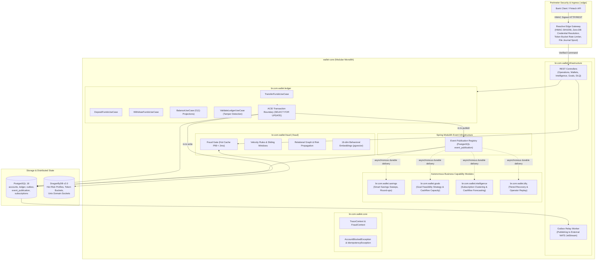
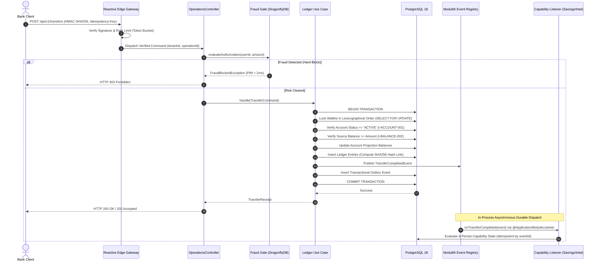
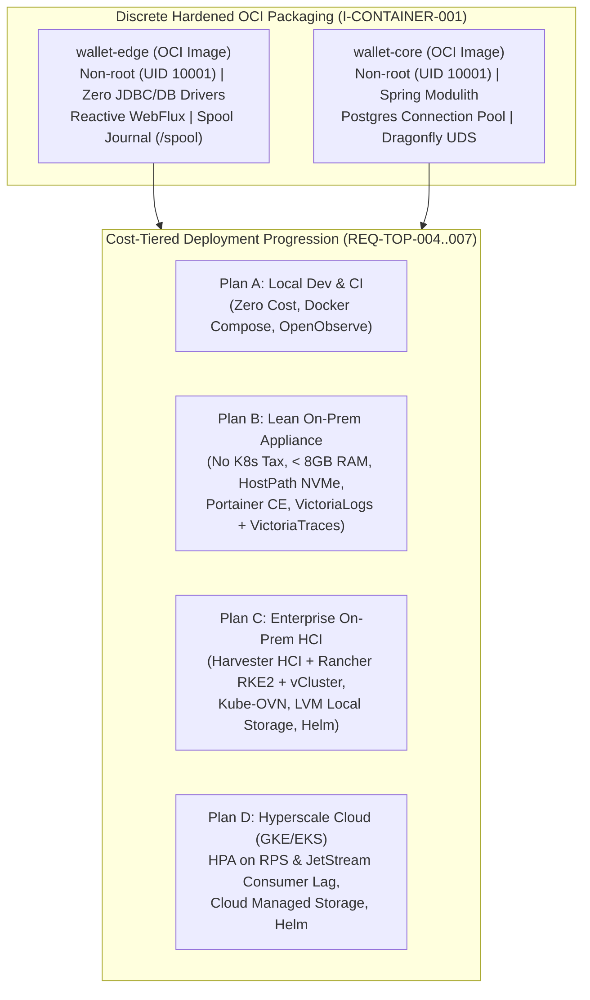

# 💳 Wallet Service — Production-Ready Core Banking & Transactional Ledger Engine

[](https://opensource.org/licenses/MPL-2.0)
[](https://openjdk.org/projects/jdk/27/)
[](https://spring.io/projects/spring-boot)
[](https://spring.io/projects/spring-modulith)
[](https://www.postgresql.org/)
[](https://dragonflydb.io/)
[](https://nats.io/)
[](https://victoriametrics.com/products/victorialogs/)

---

## 📌 Executive Overview

Modern financial institutions, neobanks, and fintech platforms face a critical challenge: legacy core banking systems are sluggish, fragile, and siloed from real-time fraud mitigation and smart automated capabilities. Conversely, many modern ledger solutions sacrifice rigorous financial invariants, regulatory auditability, and edge operational flexibility in pursuit of speed.

**Wallet Service** is an enterprise-grade, high-throughput **Transactional Ledger & Financial Capability Appliance** engineered specifically for banks, payment institutions, and fintechs. Designed with complete infrastructure portability, it operates seamlessly across hyperscale public cloud (GKE/EKS) and cost-optimized on-premises appliances (commodity bare-metal, Harvester HCI, Rancher). It bridges the gap between mathematically unassailable accounting rigor and modern reactive micro-architectures.

### Core Business & Engineering Objectives

1. **Absolute Financial Integrity**: Append-only cryptographic SHA-256 hash chaining ensures that ledger transactions are mathematically tamper-evident and historically reconstructible.
2. **Mathematical Consistency**: Account balances are strict materialized projections of double-entry ledger debits and credits ($\text{Balance} = \sum \text{Credits} - \sum \text{Debits}$), using canonical `BigDecimal` scale-2 (`HALF_EVEN`) arithmetic with zero floating-point imprecision.
3. **Multi-Tenant Sovereign Isolation**: Full multi-tenancy (`tenantId`) enforced natively from HMAC-signed perimeter ingress down to database tables, indexes, and distributed caching keys.
4. **Sub-Millisecond Fraud & Risk Gate**: Pre-execution risk evaluation ($P99 < 2\text{ms}$) in DragonflyDB, combining deterministic sliding-window velocity rules, relational graph analytics, and native Typed Decision Algebra.
5. **Autonomous Modular Capabilities (Spring Modulith)**: Peer capabilities observe banking events in-process without degrading ledger write-path throughput, providing Smart Savings Sweeps, Financial Goal Strategies, and Spending/Subscription Intelligence.
6. **Ingress & Streaming Resilience**: Reactive Edge Gateway with preallocated segmented file journals (sub-millisecond command acceptance) and PostgreSQL Event Publication Registry for zero-event-loss durability.

---

## 🏛️ Absolute Financial & System Invariants

The platform enforces strict non-negotiable invariants codified in its [Constitution](file:///.agents/rules/constitution.md):

| Invariant ID | Name | Formal Rule & Specification |
| :--- | :--- | :--- |
| **`I-LEDGER-001`** | **Immutable Source of Truth** | The `ledger` table is append-only. `UPDATE` and `DELETE` operations are strictly forbidden by database and domain constraints. |
| **`I-LEDGER-002`** | **Cryptographic Hash-Chaining** | Deterministic SHA-256 link: $\text{hash}_n = \text{SHA256}(\text{hash}_{n-1} + \text{walletId} + \text{amount} + \text{type} + \text{opId} + \text{seq})$. |
| **`I-BALANCE-001`** | **Mathematical Consistency** | Account balance is a projection that must always equal the aggregate sum of all credit and debit ledger entries: $\text{Balance} = \sum \text{Credits} - \sum \text{Debits}$. |
| **`I-BALANCE-002`** | **Non-Negative Balances** | Balances cannot drop below zero unless overdraft protection is explicitly configured. Withdrawals and transfers reject on insufficient funds. |
| **`I-ACCOUNT-001`** | **Account Lifecycle Gate** | Monetary operations involving non-`ACTIVE` accounts (`BLOCKED`, `SUSPENDED`, `FROZEN`) abort immediately with `AccountBlockedException`. |
| **`I-ATOMICITY-001`** | **Single Transaction Boundary** | Balance updates, ledger entry insertions, and outbox event recordings execute within a single atomic database transaction (`SELECT FOR UPDATE`). |
| **`I-CONCURRENCY-001`**| **Deterministic Locking** | Wallets in multi-party transfers are locked in deterministic lexicographical UUID order to eliminate deadlocks. |
| **`I-IDEMPOTENCY-001`**| **Deterministic Operations** | Operations require a client `operation_id` (`Idempotency-Key`). Replays return cached results with zero duplicate ledger writes. |
| **`I-SEC-005`** | **Tenant Transaction Boundary** | Source wallet, target wallet, and command must belong to the exact same `tenantId`. Cross-tenant transfers are forbidden. |
| **`I-FRAUD-001`** | **Pre-Execution Gate** | The fraud engine evaluates as a gate prior to domain execution and never mutates ledger balances or account states directly. |

---

## 🏗️ System Architecture (Spring Modulith DAG)

The system is architected as a **Modular Monolith (Spring Modulith)** and **Clean DDD Architecture**, eliminating microservice operational overhead while enforcing ironclad module boundaries verified at compile/test time:


```mermaid
flowchart TD
    subgraph Perimeter["Perimeter Security & Ingress (:edge)"]
        Client["Bank Client / Fintech API"]
        Edge["Reactive Edge Gateway\n(HMAC-SHA256, Zero-DB Credential Resolution,\nToken Bucket Rate Limiter, File Journal Spool)"]
    end

    subgraph CoreProcess["wallet-core (Modular Monolith)"]
        subgraph Infra["br.com.wallet.infrastructure"]
            REST["REST Controllers\n(Operations, Wallets, Intelligence, Goals, DLQ)"]
            NatsRelay["Outbox Relay Worker\n(Publishing to External NATS JetStream)"]
        end

        subgraph CoreMod["br.com.wallet.core"]
            TraceCtx["TraceContext & FraudContext"]
            DomainEx["AccountBlockedException & IdempotencyException"]
        end

        subgraph FraudMod["br.com.wallet.fraud (:fraud)"]
            FraudGate["Fraud Gate (Hot Cache P99 < 2ms)"]
            RulesEngine["Velocity Rules & Sliding Windows"]
            GraphIntel["Relational Graph & Risk Propagation"]
            Vectors["16-dim Behavioral Embeddings (pgvector)"]
        end

        subgraph LedgerMod["br.com.wallet.ledger"]
            TransferUC["TransferFundsUseCase"]
            DepositUC["DepositFundsUseCase"]
            WithdrawUC["WithdrawFundsUseCase"]
            BalanceUC["BalanceUseCase (O(1) Projections)"]
            ValidateLedgerUC["ValidateLedgerUseCase (Tamper Detection)"]
            LedgerTx["ACID Transaction Boundary (SELECT FOR UPDATE)"]
        end

        subgraph ModulithRegistry["Spring Modulith Event Infrastructure"]
            EventRegistry["Event Publication Registry\n(PostgreSQL event_publication)"]
        end

        subgraph Capabilities["Autonomous Business Capability Modules"]
            SavingsMod["br.com.wallet.savings\n(Smart Savings Sweeps, Round-ups)"]
            GoalsMod["br.com.wallet.goals\n(Goal Feasibility Strategy & Cashflow Capacity)"]
            IntelMod["br.com.wallet.intelligence\n(Subscription Clustering & Cashflow Forecasting)"]
            DlqMod["br.com.wallet.dlq\n(Tiered Recovery & Operator Replay)"]
        end
    end

    subgraph DataStore["Storage & Distributed State"]
        Postgres[(PostgreSQL 18\naccounts, ledger, outbox,\nevent_publication, subscriptions)]
        Dragonfly[(DragonflyDB v2.0\nHot Risk Profiles, Token Buckets,\nUnix Domain Sockets)]
    end

    Client -->|HMAC Signed HTTP/REST| Edge
    Edge -->|Verified Command| REST
    REST --> FraudGate
    FraudGate <--> Dragonfly
    REST --> LedgerMod
    LedgerMod --> LedgerTx
    LedgerTx --> Postgres
    LedgerTx -->|in-tx publish| EventRegistry
    EventRegistry --> Postgres

    EventRegistry -.->|asynchronous durable delivery| SavingsMod
    EventRegistry -.->|asynchronous durable delivery| GoalsMod
    EventRegistry -.->|asynchronous durable delivery| IntelMod
    EventRegistry -.->|asynchronous durable delivery| DlqMod

    LedgerTx -->|in-tx write| Postgres
    Postgres --> NatsRelay
```

---

## 💼 Business Capability Portfolio

The Wallet Service provides a rich suite of production banking capabilities:

### 1. Financial Core & Double-Entry Ledger (`br.com.wallet.ledger`)
- **Atomic Transfers, Deposits, Withdrawals**: Concurrency-safe execution with row-level locks and deterministic sequence numbers.
- **Cryptographic Tamper-Evidence**: Real-time continuous audit verification (`ValidateLedgerUseCase`) detects any unauthorized direct database alteration.
- **Fast Balance Projections**: $O(1)$ reads on `accounts` projections combined with exact on-demand historical reconstruction from the ledger.

### 2. Smart Savings Automation (`br.com.wallet.savings`)
- **Passive Event-Driven Sweeping**: Listens in-process to `TransferCompletedEvent` and `DepositCompletedEvent` via `@ApplicationModuleListener`.
- **Dynamic Savings Rules**:
  - *Micro-Savings (Round-Up)*: Rounds spending to nearest currency step (e.g. spend R$ 47.30 $\to$ round to R$ 50.00 $\to$ sweep R$ 2.70).
  - *Income Percentage Sweep*: Automatically allocates a configured percentage of incoming deposits to savings.
  - *Threshold Ceiling Sweep*: Sweeps excess funds above a target operational balance ceiling.

### 3. Financial Goal Strategy & Feasibility Engine (`br.com.wallet.goals`)
- **Stateless Mathematical Simulation**: Pure computational engine simulating target wealth timelines against monthly cashflow capacity.
- **Multi-Goal Waterfall Prioritization**: Feasibility states (`ON_TRACK`, `AT_RISK`, `UNACHIEVABLE`, `ACHIEVED`) allocated dynamically across conflicting horizons.

### 4. Spending & Subscription Intelligence (`br.com.wallet.intelligence`)
- **Deterministic Pattern Recognition**: Clusters debit histories by `(tenantId, walletId, counterpartyId)` to detect recurring periodicity (`WEEKLY`, `BI_WEEKLY`, `MONTHLY`, `ANNUAL`) and amount variance ($CV_A$).
- **Early Price Hike Alerting**: Alerts on price jumps $\ge +5\%$ on active subscriptions (`SubscriptionPriceSpikeEvent`).
- **Forward Liquidity Calendar**: Forecasts cumulative liabilities over 7, 14, and 30-day horizons ($L_7, L_{14}, L_{30}$) to preemptively warn against cashflow shortfalls.
- **Semantic Classification**: Integrates with **Native Typed Decision Algebra (`SPEC-000.8.1`)** to enrich merchant classifications (`SUBSCRIPTION` vs `INSTALLMENT` vs `UTILITY`) with graceful degradation.

### 5. Tiered DLQ & Operational Resilience (`br.com.wallet.dlq`)
- **Bounded Dead-Letter Lifecycle**: Replay engine capped at 3 retries, progressing from `PENDING` $\to$ `PROCESSING` $\to$ `EXHAUSTED`.
- **Operator REST Management**: Inspect, retry, or discard failed operations with complete diagnostic exception history.

---

## 🔄 End-to-End Write Transaction Flow


```mermaid
sequenceDiagram
    autonumber
    actor Client as Bank Client
    participant Edge as Reactive Edge Gateway
    participant REST as OperationsController
    participant Fraud as Fraud Gate (DragonflyDB)
    participant Core as Ledger Use Case
    participant DB as PostgreSQL 18
    participant Registry as Modulith Event Registry
    participant Cap as Capability Listener (Savings/Intel)

    Client->>Edge: POST /api/v1/transfers (HMAC-SHA256, Idempotency-Key)
    Edge->>Edge: Verify Signature & Rate Limit (Token Bucket)
    Edge->>REST: Dispatch Verified Command (tenantId, operationId)
    REST->>Fraud: evaluateAuthorization(userId, amount)
    alt Fraud Detected (Hard Block)
        Fraud-->>REST: FraudBlockedException (P99 < 2ms)
        REST-->>Client: HTTP 403 Forbidden
    else Risk Cleared
        REST->>Core: handle(TransferCommand)
        Core->>DB: BEGIN TRANSACTION
        Core->>DB: Lock Wallets in Lexicographical Order (SELECT FOR UPDATE)
        Core->>DB: Verify Account Status == 'ACTIVE' (I-ACCOUNT-001)
        Core->>DB: Verify Source Balance >= Amount (I-BALANCE-002)
        Core->>DB: Update Account Projection Balances
        Core->>DB: Insert Ledger Entries (Compute SHA256 Hash Link)
        Core->>Registry: Publish TransferCompletedEvent
        Core->>DB: Insert Transactional Outbox Event
        Core->>DB: COMMIT TRANSACTION
        DB-->>Core: Success
        Core-->>REST: TransferReceipt
        REST-->>Client: HTTP 200 OK / 202 Accepted
        
        Note over Registry,Cap: In-Process Asynchronous Durable Dispatch
        Registry->>Cap: onTransferCompleted(event) via @ApplicationModuleListener
        Cap->>DB: Evaluate & Persist Capability State (Idempotent by eventId)
    end
```

---

## 🌐 DevOps & Multi-Tier Deployment Topology (SPEC-000.9.2)

To serve both Tier-1 hyperscale financial institutions and local on-premises branch appliances, the platform decouples physical packaging and orchestration into **independently scalable OCI artifacts** across four cost-tiered deployment profiles:


```mermaid
flowchart TD
    subgraph Packaging["Discrete Hardened OCI Packaging (I-CONTAINER-001)"]
        ImgEdge["wallet-edge (OCI Image)\nNon-root (UID 10001) | Zero JDBC/DB Drivers\nReactive WebFlux | Spool Journal (/spool)"]
        ImgCore["wallet-core (OCI Image)\nNon-root (UID 10001) | Spring Modulith\nPostgres Connection Pool | Dragonfly UDS"]
    end

    subgraph Topologies["Cost-Tiered Deployment Progression (REQ-TOP-004..007)"]
        PlanA["Plan A: Local Dev & CI\n(Zero Cost, Docker Compose, OpenObserve)"]
        PlanB["Plan B: Lean On-Prem Appliance\n(No K8s Tax, < 8GB RAM, HostPath NVMe,\nPortainer CE, VictoriaLogs + VictoriaTraces)"]
        PlanC["Plan C: Enterprise On-Prem HCI\n(Harvester HCI + Rancher RKE2 + vCluster,\nKube-OVN, LVM Local Storage, Helm)"]
        PlanD["Plan D: Hyperscale Cloud (GKE/EKS)\nHPA on RPS & JetStream Consumer Lag,\nCloud Managed Storage, Helm"]
    end

    ImgEdge --> Topologies
    ImgCore --> Topologies
```

### 1. Cost-Tiered Deployment Profiles

| Deployment Profile | Target Infrastructure | Control Plane | Storage Binding | Telemetry Backend | Footprint & Sizing |
| :--- | :--- | :--- | :--- | :--- | :--- |
| **Plan A: Local Dev & CI** | Developer Workstation / CI Runner | Single-host Docker Compose | Ephemeral Docker Volume | **OpenObserve** + OTel Collector | $< 4\text{GB}$ RAM, zero software cost |
| **Plan B: Lean Appliance** | Commodity Bare-Metal Server / Single VM | Docker Engine + **Portainer CE** (GitOps Webhooks) | Direct HostPath NVMe (`/spool`) | **VictoriaLogs** + **VictoriaTraces** | $< 8\text{GB}$ RAM total, slashes Kubernetes control plane tax |
| **Plan C: Enterprise On-Prem** | Private Datacenter / Bank Appliance | **Harvester HCI** + **Rancher RKE2** + **vCluster** | LVM Local Storage (Direct NVMe IOPS) | OpenObserve or VictoriaLogs via OTel | High Availability, Kube-OVN, multi-tenant vClusters |
| **Plan D: Hyperscale Cloud** | Google Cloud (GKE) / AWS (EKS) | Kubernetes with HPA Elasticity | Dedicated CSI Block Volume (`ReadWriteOnce`) | Cloud Managed / OpenObserve Cluster | Auto-scaling on RPS and NATS consumer lag |

### 2. Dual Telemetry Strategy: OpenObserve vs. VictoriaLogs

Observability overhead must not degrade banking throughput or saturate lean appliances:

- **Standard & Cloud Environments (`docker-compose.yaml` / Plan C & D)**:
  - Deploys **OpenObserve** as an all-in-one OTLP backend for traces, metrics, and logs with SIMD-accelerated search and object storage persistence.
- **Lean On-Premises Appliances (`docker-compose.appliance.yaml` / Plan B)**:
  - Deploys **VictoriaLogs** (`victoriametrics/victoria-logs`) and **VictoriaTraces** (`victoriametrics/victoria-traces`).
  - Slashes monitoring memory consumption to $< 256\text{MB}$ RAM with zero JVM overhead and industry-leading log compression ratios, preserving commodity appliance resources exclusively for ledger execution.

### 3. Automated OCI Delivery & Appliance GitOps (`REQ-TOP-016..018`)

- **Hardened Image Delivery**: GitHub Actions workflow builds multi-stage non-root OCI images published to GitHub Container Registry (`ghcr.io/kyogoiano/wallet-edge` and `ghcr.io/kyogoiano/wallet-core`).
- **Unified Helm OCI Packaging**: Helm charts are packaged and distributed as OCI artifacts directly to GHCR (`oci://ghcr.io/<owner>/charts/wallet-platform`), eliminating static HTTP chart repositories.
- **Continuous Appliance Deployment**: Plan B lean appliances trigger automated redeployments via Portainer GitOps Webhooks on new image publication.

---

## ⚙️ Technology Stack

| Category | Component / Library | Strategic Rationale |
| :--- | :--- | :--- |
| **Runtime & Language** | **Java 27** (OpenJDK 27) | Virtual threads, record patterns, strongly typed decision algebra, zero boilerplate. |
| **Framework** | **Spring Boot 4.2.0-M2** & **Spring Modulith 2.2.0-M2** | Next-generation reactive/virtual thread runtime, architectural boundary verification, Event Publication Registry. |
| **Relational Database** | **PostgreSQL 18** + `pgvector` | ACID transactions, `SKIP LOCKED` queues, append-only ledger, 16-dim behavioral profile vector search. |
| **Distributed Cache & State** | **DragonflyDB v2.0** | High-performance multi-threaded Redis-compatible store, Unix Domain Socket (`redis.sock`) hot paths. |
| **Event Streaming** | **NATS JetStream** | Ultra-low latency asynchronous messaging for transactional outbox external egress. |
| **Micro-ML & Local SLM** | **ONNX Runtime Java** & **Ollama SLM SPI** | Air-gapped nearline semantic classification and behavioral risk scoring. |
| **Observability** | **Dual Telemetry Architecture**: OpenTelemetry Java SDK $\to$ **OpenObserve** (Cloud/Dev) or **VictoriaLogs & VictoriaTraces** (Lean On-Premises Appliance) | High-compression logs and distributed traces tailored to target hardware profile, PII masking, sub-second query latency. |
| **Testing** | **JUnit 5, AssertJ, Testcontainers, ArchUnit** | Testcontainers for PostgreSQL, DragonflyDB, and NATS; ArchUnit for zero architectural drift. |

---

## 🧪 Engineering Discipline & Quality Standards

This project adheres to the **Spec-Driven Design (SDD)** and **Zero Vibe Coding** methodology:

1. **Spec First (`I-SDD-001`)**: No code is written without a ratified Specification (`.spec/SPEC-XXX.md`), Architecture Plan (`.spec/plans/PLAN-XXX.md`), and Task List (`.spec/tasks/TASKS-XXX.md`).
2. **MoSCoW Prioritization Gate (`I-SDD-004`)**: All requirements are strictly tagged (`[MUST]`, `[SHOULD]`, `[COULD]`, `[WON'T]`). `[MUST]` requirements are implemented and verified first.
3. **Mandatory Test Triads (`I-TDD-002`)**: Every requirement enforces a strict triad:
   - **Positive Canonical Test**: Proves nominal business flow.
   - **Boundary / Negative Input Gate**: Validates error handling and boundary edge cases.
   - **Invariant Breach Gate**: Asserts immediate failure on any invariant violation attempt.
4. **Architectural Verification**: Automated `ModulithArchitectureTest` runs on every build, ensuring zero circular dependencies and 100% adherence to declared module interfaces.

---

## 🚀 Getting Started

### Prerequisites
- **JDK 27** installed
- **Docker & Docker Compose** (for local dependencies)
- **Gradle 9.x** (or Gradle wrapper)

### Deployment Setup Options

#### Option 1: Standard Developer & Cloud Stack (Plan A / OpenObserve)
Starts the standard environment with PostgreSQL 18 + pgvector, DragonflyDB, NATS JetStream, and **OpenObserve** for full-featured OTLP telemetry:

```bash
docker compose -f docker-compose.yaml up -d
```

#### Option 2: Lean On-Premises Appliance (Plan B / VictoriaLogs & Portainer)
Starts the resource-constrained appliance stack ($< 8\text{GB}$ total RAM) with **VictoriaLogs**, **VictoriaTraces**, and **Portainer CE**:

```bash
docker compose -f docker-compose.appliance.yaml --profile telemetry up -d
```

Verify services are healthy:
```bash
docker compose ps
```

#### Option 3: Enterprise Kubernetes / Harvester HCI (Plan C & D via Helm)
Deploy to SUSE Harvester HCI / Rancher RKE2 or GKE via Helm:

```bash
# Harvester HCI / On-Prem Enterprise
helm install wallet-platform ./deploy/helm/wallet-platform -f ./deploy/helm/wallet-platform/values-harvester.yaml

# Google Cloud GKE / Public Cloud Elastic
helm install wallet-platform ./deploy/helm/wallet-platform -f ./deploy/helm/wallet-platform/values-gke.yaml
```

### Running the Test Suite

Execute the full suite of unit, integration, and architecture tests:

```bash
./gradlew test
```

Generate test coverage and verification reports:
```bash
./gradlew jacocoTestReport
```

### Core API Endpoints

| Method | Endpoint | Description |
| :--- | :--- | :--- |
| `POST` | `/api/v1/transfers` | Atomic transfer between wallets (`Idempotency-Key` required). |
| `POST` | `/api/v1/deposits` | Deposit funds into an active wallet. |
| `POST` | `/api/v1/withdrawals` | Withdraw funds from an active wallet. |
| `GET` | `/api/v1/wallets/{id}/balance` | Query current strongly consistent account balance. |
| `GET` | `/api/v1/wallets/{id}/balance/historical?at={iso}` | Reconstruct historical balance from immutable ledger. |
| `GET` | `/api/v1/intelligence/subscriptions/{walletId}` | Query detected recurring subscriptions and price hike alerts. |
| `GET` | `/api/v1/intelligence/cashflow/{walletId}/projections` | Query forward 7/14/30-day liabilities and liquidity shortfall status. |
| `POST` | `/api/v1/savings/plans` | Create a dynamic smart savings plan (round-up/percentage/threshold). |
| `GET` | `/actuator/health` | Application health and readiness indicators. |

---

## 📄 License

This Source Code Form is subject to the terms of the **Mozilla Public License, v. 2.0**. If a copy of the MPL was not distributed with this file, You can obtain one at [https://mozilla.org/MPL/2.0/](https://mozilla.org/MPL/2.0/).

See the [LICENSE](file:///LICENSE) file for the full license text.