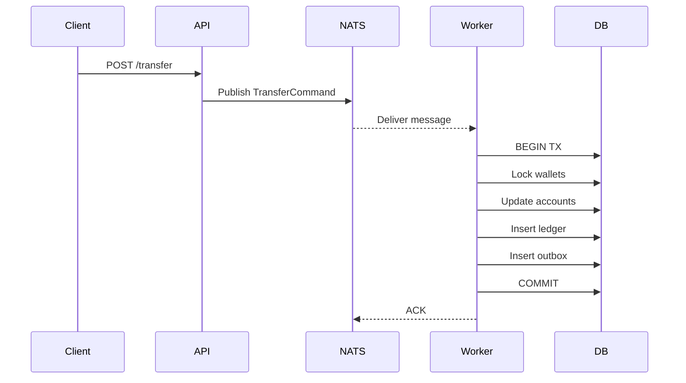

# Wallet Service — V2 Architecture (Event-Driven with NATS JetStream)

## 🧭 Overview

This document describes the evolution of the Wallet Service from a synchronous ACID-based system to an event-driven architecture using NATS JetStream.

The goal of this evolution is to support high concurrency, scalability, and resilience while preserving core domain invariants.

---

## NATS Clean Architecture

Client
↓
Command (operation_id)
↓
NATS (dedup hint)
↓
Consumer
↓
Idempotent Use Case (DB)
↓
Outbox (atomic)
↓
Relay
↓
NATS (dedup again)
↓
Downstream (same pattern)

---

## 📊 Observability Stack

A arquitetura V2 integra um pipeline completo de observabilidade:

- **OpenTelemetry (OTel)**: Coleta de Traces, Metrics e Logs.
- **OpenObserve**: Backend de alta performance para análise de dados OTLP.
- **Correlação**: O `operation_id` é propagado como Baggage, correlacionando logs do API e Workers.

---

## 🧱 C4 Model — V2

### Level 1 — System Context
```
[ Client / External Systems ]
            ↓
     [ Wallet Service ] ↔ [ OTel Collector ] → [ OpenObserve ]
            ↓
     [ PostgreSQL ]

            ↓
     [ NATS JetStream ]
```
---

### Level 2 — Container Diagram
```
[ REST API (Spring Boot) ]
        ↓ (publish command)
[ NATS JetStream ]

[ Command Consumers (Use Cases Workers) ]
        ↓
[ Domain + Application Layer ]
        ↓
[ PostgreSQL ]

[ Outbox Relay (optional evolution) ]
        ↓
[ NATS / External Systems ]
```
---

### Level 3 — Component Diagram
```
[ OperationsController ]
        ↓
[ Command Publisher (NATS) ]
        ↓
[ JetStream Stream ]
```
-------------------------------
```
[ TransferConsumer ]
        ↓
[ TransferUseCase ]
        ↓
[ Ledger + Accounts + Outbox ]

[ WithdrawConsumer ]
        ↓
[ WithdrawUseCase ]

[ DepositConsumer ]
        ↓
[ DepositUseCase ]
```
---

### Level 4 — Sequence (Transfer Flow)


---

## ⚡ Architecture Changes

### API Layer

- Publishes commands instead of executing business logic
- Returns HTTP 202 Accepted
- Non-blocking (using CompletableFuture + Virtual Threads)

---

### Use Case Layer

- Runs as message consumers (SmartLifecycle)
- Owns transaction boundaries
- Handles retries and failures via JetStream ACK policy

---

### Messaging Layer (NATS JetStream)

- Persistent streams
- At-least-once delivery
- Replay capability
- Backpressure handling (MaxAckPending)

---

## 🔁 Idempotency

Idempotency remains critical:

- operation_id (UUID)
- Prevents double processing
- Handled at the application service level

---

## ⚖️ Trade-offs

Benefits:
- High scalability
- Better fault tolerance
- Replay capability
- Full visibility (OTel + OpenObserve)

Costs:
- Increased complexity
- Eventual consistency
- Distributed tracing requirement

---

## 🧠 When to Use V2

- High throughput systems
- Distributed deployments
- Need for resilience and replay

---

## 🚧 What Remains the Same

- Ledger is source of truth
- ACID transactions
- Domain rules unchanged
- Outbox pattern still valid

---

## 🔮 Future Improvements

- Dead-letter queues (DLQ) improvements: 
  - improve table partitioning with automatic service pgpartman 
  - fairness implementation on db level
- gRPC / QUIC ingestion (also GRPC on opentelemetry)
- Multi-region support
- Move to Nats cluster (with 3 nodes)
- Improve Nats security (TLS + Token rotation)

---

## 🧠 Design Insight

The system evolves from synchronous to event-driven only after ensuring correctness in the domain.

This avoids premature complexity and keeps the core stable.

---

## 💡 Key Principle

"The system is designed to scale from a monolithic ACID model to a distributed event-driven architecture without rewriting core domain logic."
