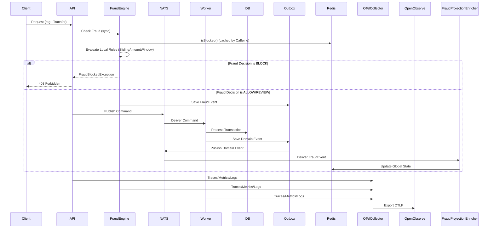

# 🛡️ Wallet Service — Fraud & Risk Engine (V3)

## 🧭 Overview

This document introduces a Fraud & Risk Engine for the Wallet Service, significantly enhancing its capabilities.

The engine is designed to:

- Detect suspicious financial behavior
- Prevent abuse (ATO, cash-out, mule accounts)
- Maintain O(1) evaluation per request using optimized local state
- Preserve stateless API while enabling controlled statefulness
- Centralize fraud check logic via `FraudCheckHelper` and `FraudCheckable` interface
- Provide immediate feedback for blocked transactions via `FraudBlockedException`

---

## 🧠 Design Principles

### 1. Non-invasive to core domain

The ledger remains the source of truth.

Fraud engine acts as a pre-execution gate:

```
request → fraud engine → decision → execute use case
```

---

### 2. O(1) evaluation (hot path)

- No scans
- Optimized `SlidingAmountWindow` with bucket-array for efficient time-based aggregation
- Local state managed by Caffeine for fast access and automatic eviction

---

### 3. Multi-layer state model

| Layer        | Scope | Consistency | Purpose | Implementation |
|-------------|------|------------|--------|----------------|
| Local       | Pod  | Strong     | Fast checks | `SlidingAmountWindow` (Caffeine) |
| Distributed | Redis| Eventual   | Global behavior | Redis `EXISTS` (cached by Caffeine) |
| Async       | NATS | Eventual   | Enrichment | `FraudEvent` via Outbox |

---

## 🧱 Architecture Extension



---

## 🛡️ Fraud Types Covered

### 1. Account Takeover (ATO)

- New device/IP
- Credential change

Rule:
```
recent credential change + high value transfer → BLOCK
```

---

### 2. Cash-Out (Account Draining)

- Large transfer
- Rapid sequence
- New recipient

Rule:
```
sum(last 30s) > threshold → BLOCK (using SlidingAmountWindow)
```

---

### 3. Mule Accounts

- Deposit → immediate transfer
- High turnover

Rule:
```
low retention time → increase risk
```

---

### 4. Velocity Attacks

- Many operations in short time

Rule:
```
count(last N seconds) > threshold (using SlidingAmountWindow)
```

---

### 5. Behavior Anomaly

- Deviation from baseline

Rule:
```
current_amount >> avg_amount
```

---

## ⚙️ Rule Categories

### 🟢 Local Rules (O(1) - Caffeine & SlidingAmountWindow)

- `SlidingAmountWindow` (value and count)
- New recipient detection

Example:

```java
if (window.getTotalAmount() > limit) BLOCK;
```

---

### 🟡 Global Rules (Redis - Cached)

Eventually consistent.

Examples:

```
user:{id}:daily_volume
user:{id}:risk_score
user:{id}:unique_recipients
user:{id}:blocked (cached)
```

---

### 🔵 Async Rules (NATS)

* Aggregations
* Behavior enrichment
* Pattern detection

---

## 🧠 Scoring Engine

### Score Calculation

```java
int score = 0;

if (isNewDevice) score += 3;
if (isNewRecipient) score += 5;
if (isHighAmount) score += 7;
if (isVelocitySpike) score += 4;
if (isLowRetention) score += 6;
```

---

### Decision

```java
if (score >= 12) BLOCK;
else if (score >= 7) REVIEW;
else ALLOW;
```

---

## ⚡ Sliding Window Strategy

### Local (`SlidingAmountWindow`)

*   Bucket-array based implementation for `O(1)` updates and queries.
*   Managed by Caffeine cache for automatic eviction of inactive user windows.
*   Uses `LongAdder` for thread-safe, high-performance aggregation.

---

### Global

Keys:

```
user:{id}:bucket:{timestamp}
```

TTL:

```
expire after window
```

---

## 🔁 Event-Driven Enrichment

### Events

```
transaction.requested
transaction.approved
transaction.blocked
```

---

### Consumers

#### FraudProjectionEnricher

* Updates Redis
* Maintains aggregates

#### RiskAggregator

* Builds long-term metrics

---

## 🧠 State Evolution

### Phase 1

* Stateless
* Local rules

### Phase 2

* `SlidingAmountWindow`
* Score engine

### Phase 3

* Redis global state (with Caffeine caching for `isBlocked`)

### Phase 4

* Async enrichment (NATS)

---

## 📊 Observability (OpenTelemetry & OpenObserve)

- **Distributed Tracing**: All operations are traced, with `operation_id` propagated as baggage for end-to-end correlation.
- **Log Aggregation**: Structured logs are exported via OTLP to OpenObserve.
- **Metrics**: Application and system metrics are collected and exported via OTLP to OpenObserve.

---

## ⚠️ Trade-offs

| Choice               | Impact         |
| -------------------- | -------------- |
| Eventual consistency | Acceptable     |
| Redis dependency     | Extra infra    |
| Local state          | Possible drift |

---

## 🔐 Safety Guarantees

* Fraud engine never mutates ledger
* Only blocks or delays
* Idempotency preserved
* `FraudBlockedException` provides immediate feedback for blocked operations

---

## 🚀 Future Extensions

* Graph-based fraud detection
* ML models
* Device fingerprinting
* Geo anomaly detection

---

## 🧭 Final Insight

Fraud detection is probabilistic.

Goal:

```
maximize detection
minimize false positives
```
