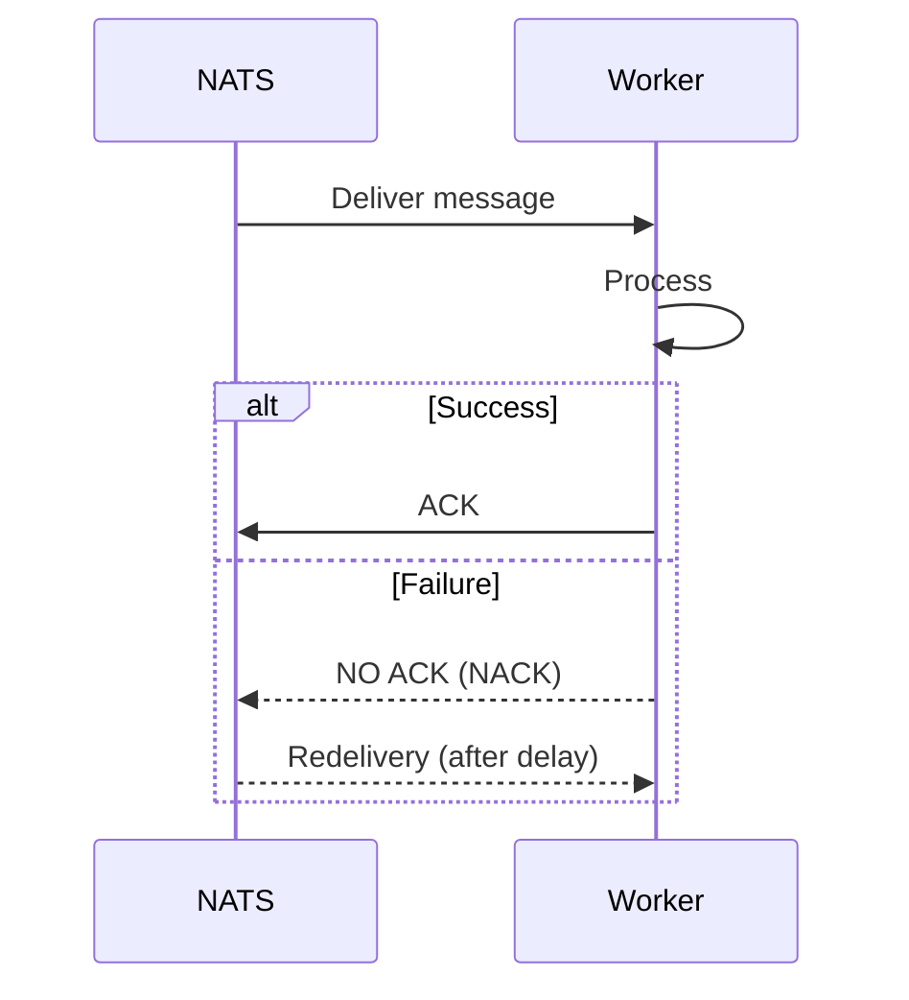

# Wallet Service — V2 Architecture (Production-Ready Event-Driven with NATS JetStream)

## 🧭 Overview

This document describes the evolution of the Wallet Service to a production-grade event-driven architecture using NATS JetStream.

The focus of this version is not only scalability, but **correctness under failure**, **predictable retries**, and **operational resilience**.

---

## 🧱 Core Principles

- Ledger is the source of truth
- All operations are idempotent
- Message processing is at-least-once
- Failures are expected and handled explicitly
- Observability is built-in (OpenTelemetry + OpenObserve)

---

## ⚡ Architecture Summary

Exactly-once illusion = At-least-once delivery + Idempotency + Atomic Outbox

### Flow

Client → API → NATS → Worker → DB → ACK

---

## 📊 Observability & Monitoring (OpenObserve)

A arquitetura V2 utiliza a stack **OTel + OpenObserve** para garantir visibilidade total.

### Features
- **Distributed Tracing**: O `operation_id` é injetado como Baggage e correlacionado em todos os Spans.
- **Log Aggregation**: Logs estruturados enviados via OTLP para o OpenObserve.
- **Metrics**: Monitoramento de latência e saúde dos consumers NATS.

---

## 🔁 Message Processing Model

### Rules

- Each message is processed **exactly once logically** (via idempotency)
- Each message may be delivered **multiple times physically**
- The system MUST tolerate duplicate deliveries

### Subject convention
- `commands.transfer`
- `commands.withdraw` 
- `commands.deposit`
- `commands.wallet`

---

## ❗ Explicit Rule: No Retry in Handler

### 🚫 Forbidden

- No retry loops inside consumers
- No exponential backoff in application code

### ✅ Correct Behavior

- Process message once
- If success → ACK
- If failure → DO NOT ACK (NACK)

JetStream will handle redelivery based on the `ack_wait` and `backoff` policy.

---

## 🔁 Retry Strategy (System-Level)

### Sequence



---

## ⚙️ JetStream Consumer Configuration

```yaml
consumer:
  durable: wallet-transfer
  ack_policy: explicit
  ack_wait: 30s
  max_deliver: 5
  max_ack_pending: 100
```

---

## ☠️ Poison Message Handling (DLQ)

Messages exceeding `max_deliver` are moved to a Dead Letter Queue (DLQ) subject (e.g., `commands.dlq.*`).

### DLQ Metadata
- `original_subject`
- `error_message`
- `failure_type`
- `delivery_count`

---

## 🔁 Idempotency Guarantees

### Mechanism

- Each command includes `operation_id (UUID)`
- Validated via `WalletOperationsDao.registerOperation(operationId)`

### Behavior

| Scenario | Result |
|---------|--------|
| First execution | Process normally |
| Duplicate message | Throws IdempotencyException (ACKed) |
| Retry after failure | Safe re-execution |

---

## ⚠️ Failure Handling Strategy

### 1. Business Failures
Examples: insufficient balance, invalid account.
**Action**: ACK message (do not retry), log warning.

### 2. Transient Failures
Examples: DB timeout, network glitch.
**Action**: NACK message, let JetStream retry.

### 3. Permanent Failures
Examples: Serialization error, invalid subject.
**Action**: Send to DLQ, ACK original message.

---

## 📉 Backpressure & Scalability

- **Bulkhead**: Consumers are isolated by subject and thread pool (Virtual Threads).
- **Backpressure**: Controlled via `max_ack_pending` in JetStream.

---

## 💡 Final Principle

"Reliability is achieved not by avoiding failures, but by designing the system to behave correctly when failures happen."
