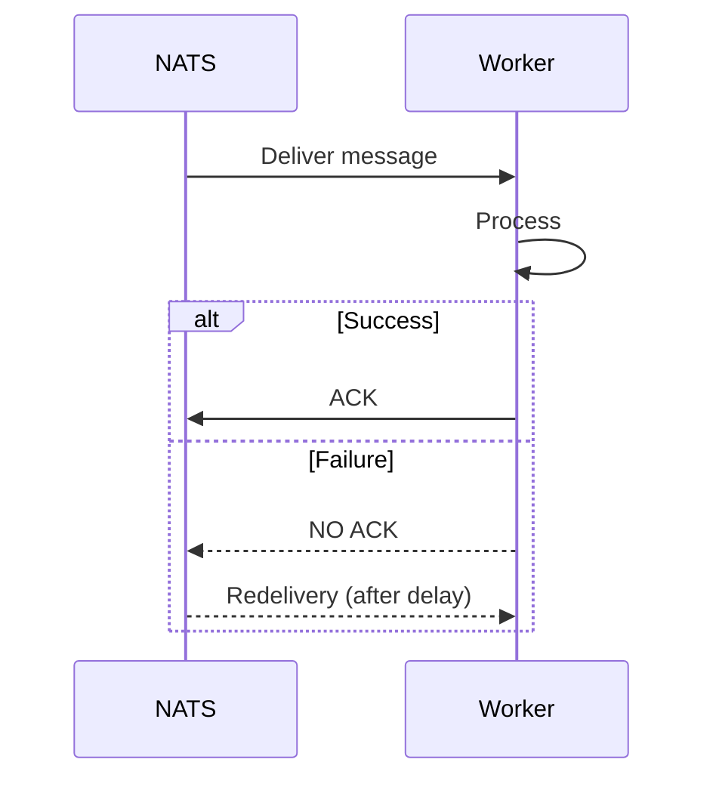
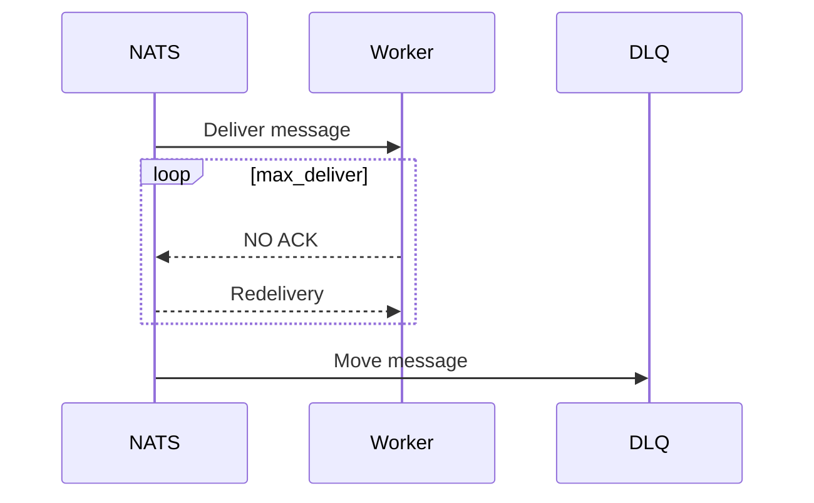
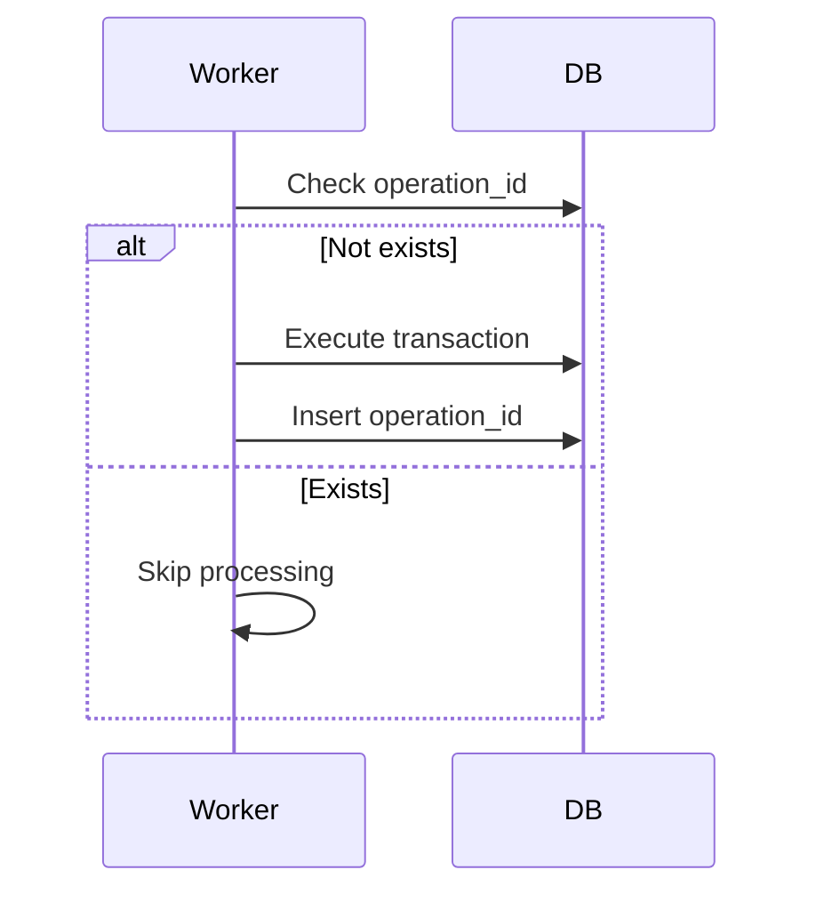
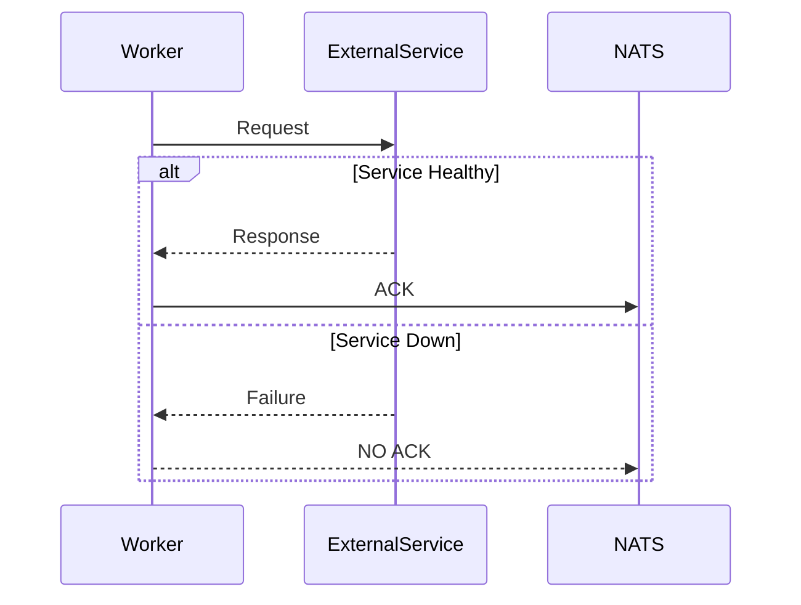

# Wallet Service — V2 Architecture (Production-Ready Event-Driven with NATS JetStream)

## 🧭 Overview

This document describes the evolution of the Wallet Service to a production-grade event-driven architecture using NATS JetStream.

The focus of this version is not only scalability, but **correctness under failure**, **predictable retries**, and **operational resilience**.

---

## 🧱 Core Principles

- Ledger is the source of truth
- All operations are idempotent
- Message processing is at-least-once
- Failures are expected and handled explicitly
- Retry is delegated to the messaging system

---

## ⚡ Architecture Summary

Exactly-once illusion = At-least-once delivery + Idempotency + Atomic Outbox

### Flow

Client → API → NATS → Worker → DB → ACK

---

## 🔁 Message Processing Model

### Rules

- Each message is processed **exactly once logically** (via idempotency)
- Each message may be delivered **multiple times physically**
- The system MUST tolerate duplicate deliveries

### Subject convention
- commands.wallet.transfer
- commands.wallet.withdraw 
- commands.wallet.deposit
** predictable + scalable **
---

## ❗ Explicit Rule: No Retry in Handler

### 🚫 Forbidden

- No retry loops inside consumers
- No exponential backoff in application code
- No wrapping handlers with retry frameworks

### ✅ Correct Behavior

- Process message once
- If success → ACK
- If failure → DO NOT ACK

JetStream will handle redelivery.

---

## 🔁 Retry Strategy (System-Level)

### Sequence



---

## ⚙️ JetStream Consumer Configuration

Example configuration:

```yaml
consumer:
  durable: wallet-transfer
  ack_policy: explicit
  ack_wait: 30s
  max_deliver: 5
  max_ack_pending: 100
```

### Explanation

- **ack_policy: explicit** → ensures manual ACK control
- **ack_wait** → timeout before retry
- **max_deliver** → retry limit
- **max_ack_pending** → backpressure control

---

## ☠️ Poison Message Handling

A message becomes poison when:

- It fails repeatedly
- It violates domain invariants
- It cannot be processed deterministically

### Flow



---

## 📦 Dead Letter Queue (DLQ) Strategy

### Rules

- Messages exceeding `max_deliver` go to DLQ
- DLQ is a separate stream
- DLQ messages are NOT retried automatically

### DLQ Metadata

Each message should include:

- operation_id
- failure_reason
- attempt_count
- timestamp

---

## 🔁 Idempotency Guarantees

### Mechanism

- Each command includes `operation_id (UUID)`
- Stored in DB with unique constraint

### Behavior

| Scenario | Result |
|---------|--------|
| First execution | Process normally |
| Duplicate message | Ignored safely |
| Retry after failure | Safe re-execution |

---

## 🧠 Idempotent Processing Flow



---

## ⚠️ Failure Handling Strategy

### Categories

#### 1. Business Failures (Expected)

Examples:
- insufficient balance
- invalid account

Handling:
- Do NOT retry
- ACK message
- Emit domain event (optional)

---

#### 2. Transient Failures (Retryable)

Examples:
- DB timeout
- network glitch

Handling:
- DO NOT ACK
- Let JetStream retry

---

#### 3. System Failures (Critical)

Examples:
- database unavailable
- service dependency down

Handling:
- DO NOT ACK
- System backpressure applies

---

## 🔌 Circuit Breaker Strategy (Conceptual)

Even without a library, the system should behave as follows:



### Principle

- Fail fast
- Do not block threads
- Let message retry later

---

## 🧱 Bulkhead Strategy

Isolation is achieved via:

- Separate consumers per use case
- Independent processing pipelines

Example:

- TransferConsumer
- WithdrawConsumer
- DepositConsumer

Failure in one does NOT block others.

---

## 📉 Backpressure Handling

Controlled by JetStream:

- max_ack_pending
- consumer pull limits

System naturally slows down instead of crashing.

---

## 🔮 Future Improvements

- Observability (tracing per operation_id)
- Replay tooling
- Manual DLQ reprocessing tools
- Saga orchestration

---

## 💡 Final Principle

"Reliability is achieved not by avoiding failures, but by designing the system to behave correctly when failures happen."

